# Linux基础知识

> 章节只介绍使用公钥ssh连接远程服务器，使用密码方式不在书写范围。

## 一、配置InternStudio开发机
### 1、本地生成公钥
`ssh-keygen -t rsa`
此时默认会在家目录下生成～/.ssh/id_rsa.pub公钥 和～/.ssh/id_rsa私钥
### 2、公钥加载到InternStudio控制台
路径：点击首页->配置 ssh key->添加 ssh公钥
将～/.ssh/id_rsa.pub内容复制到输入框，保存
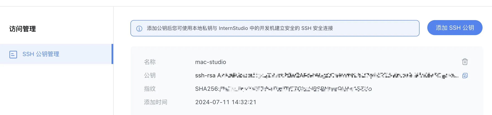
### 3、启动开发机
- 创建开发机
 
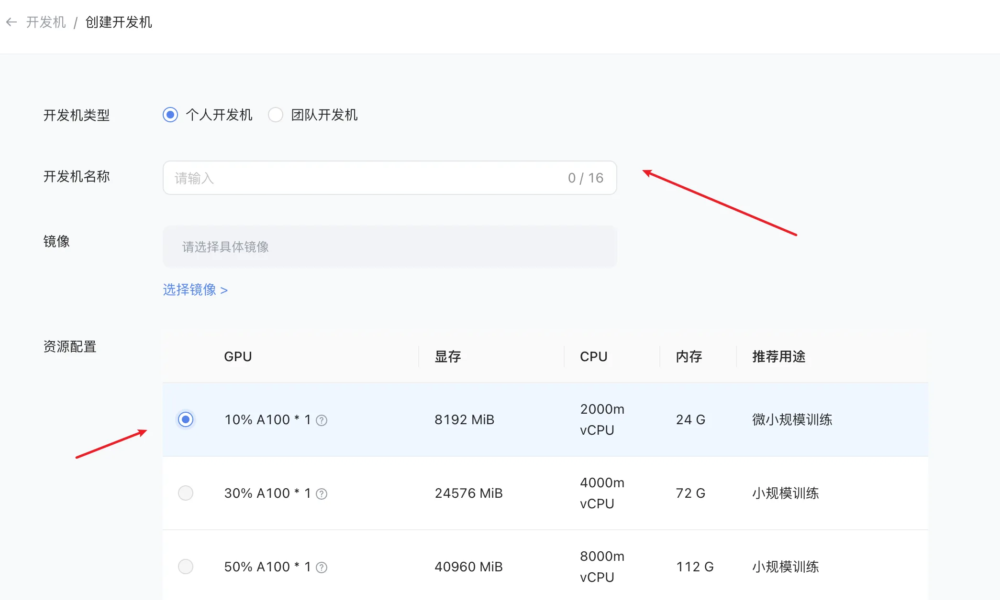
时长根据自己想运行时间来设置
- 启动
  点击启动，稍等片刻开发机即可运行
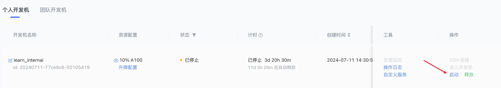
### 4、本地终端连接开发机
`ssh -p XXX root@ssh.intern-ai.org.cn -o StrictHostKeyChecking=no -o UserKnownHostsFile=/dev/null`
-p 指定ssh远程端口
成功后会显示如下：
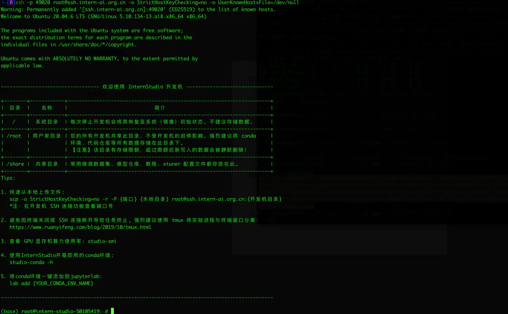
执行任意命令
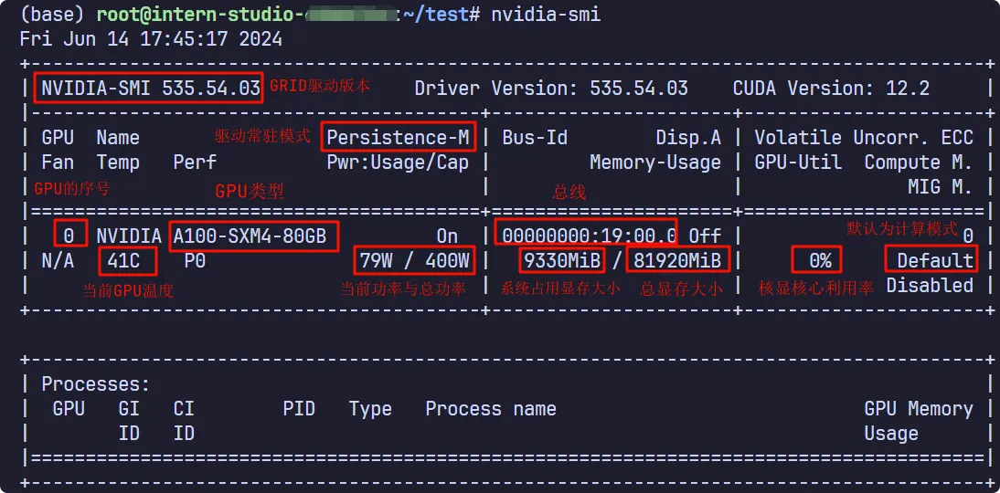
## 二、vscode 远程连接开发机
优势：可以使用开发机的环境，不用在本地搭建。
### 1、安装微软 ssh 插件
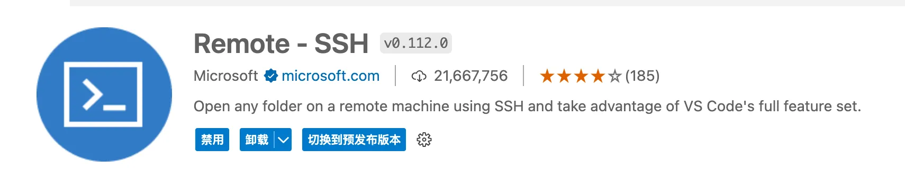
### 2、添加远程连接配置
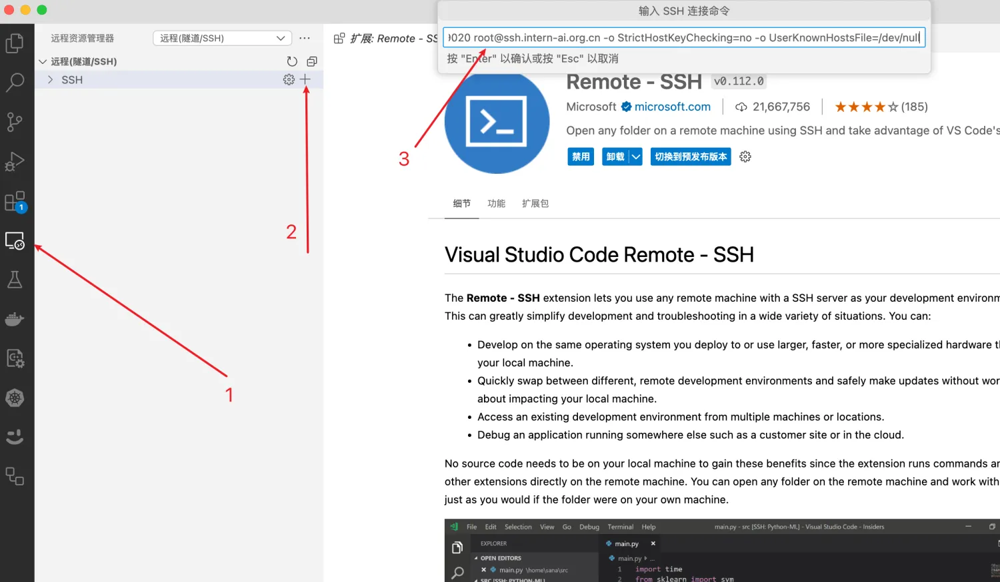
### 3、连接到远程开发机
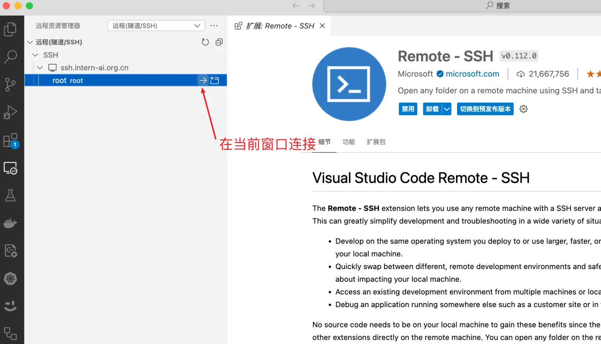
稍等片刻即可连接成功
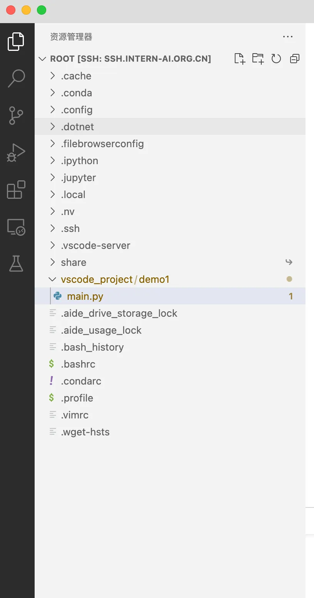
## 三、部署服务并连接
服务为 python 服务，监听端口为 7680
### 1、安装python 依赖
`pip install gradio`
### 2、创建 main.py 文件
```python
import socket
import re
import gradio as gr
 
# 获取主机名
def get_hostname():
    hostname = socket.gethostname()
    match = re.search(r'-(\d+)$', hostname)
    
    name = match.group(1)
    
    return name
 
# 创建 Gradio 界面
with gr.Blocks(gr.themes.Soft()) as demo:
    html_code = f"""
            <p align="center">
            <a href="https://intern-ai.org.cn/home">
                
            </a>
            </p>
            <h1 style="text-align: center;">☁️ Welcome {get_hostname()} user, welcome to the ShuSheng LLM Practical Camp Course!</h1>
            <h2 style="text-align: center;">😀 Let’s go on a journey through ShuSheng Island together.</h2>
            <p align="center">
                <a href="https://github.com/InternLM/Tutorial/blob/camp3">
                    
                </a>
            </p>

            """
    gr.Markdown(html_code)

demo.launch()
```
### 3、启动服务
vscode终端执行命令`python main.py`
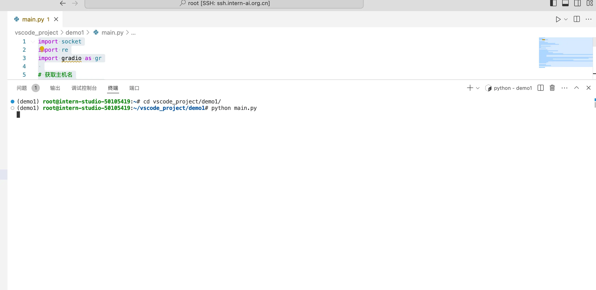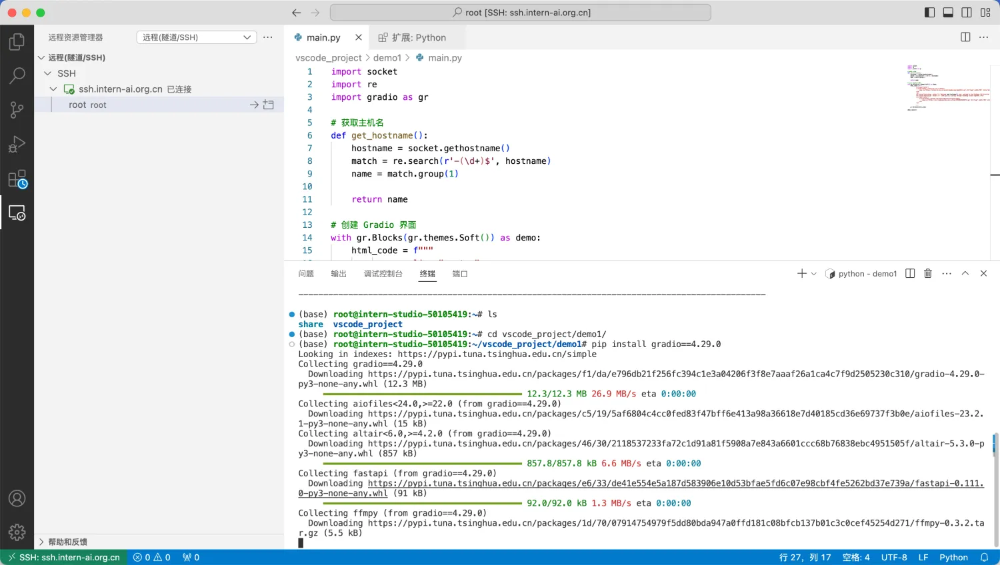

### 4、浏览器访问应用
vscode 插件，默认会自动开启对应的端口映射功能
点击端口即可查看
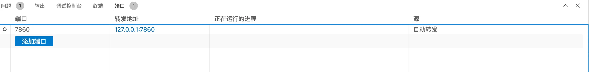

ssh端口映射手动实现
```
ssh -p 49020 root@ssh.intern-ai.org.cn -CNg -L {本地机器_PORT}:127.0.0.1:{开发机_PORT} -o StrictHostKeyChecking=no

命令各部分的含义：

● -p 37367：是指定 SSH 连接的端口为 37367，这个前面提到过。
● root@ssh.intern-ai.org.cn：表示要以 root 用户身份连接到 ssh.intern-ai.org.cn 这个主机。
● -CNg：
  ○ -C 通常用于启用压缩。
  ○ -N 表示不执行远程命令，仅建立连接用于端口转发等。
  ○ -g 允许远程主机连接到本地转发的端口。
● -L {本地机器_PORT}:127.0.0.1:{开发机_PORT}：这是设置本地端口转发，将本地机器的指定端口（由 {本地机器_PORT} 表示）转发到远程主机（这里即 ssh.intern-ai.org.cn）的 127.0.0.1 （即本地回环地址）和指定的开发机端口（由 {开发机_PORT} 表示）。
● -o StrictHostKeyChecking=no：关闭严格的主机密钥检查，这样可以避免第一次连接时因为未知主机密钥而产生的提示或错误。
```
地址栏查看：http://localhost:7860

