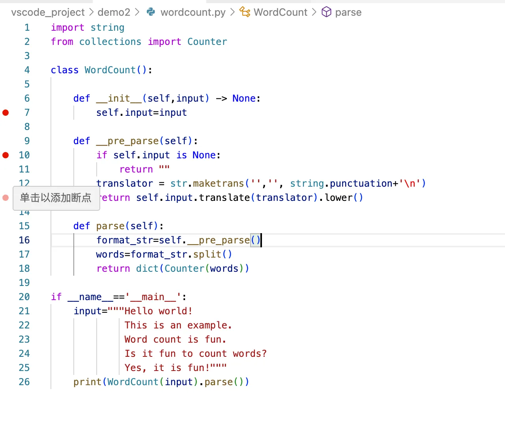
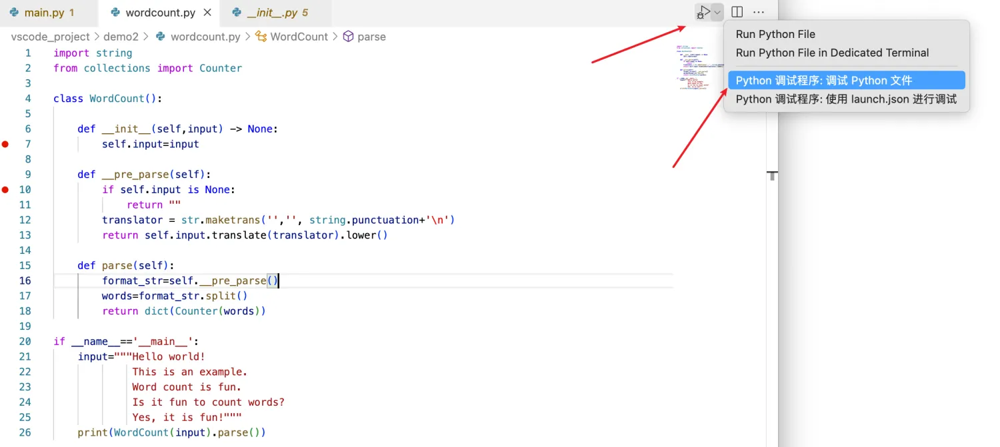
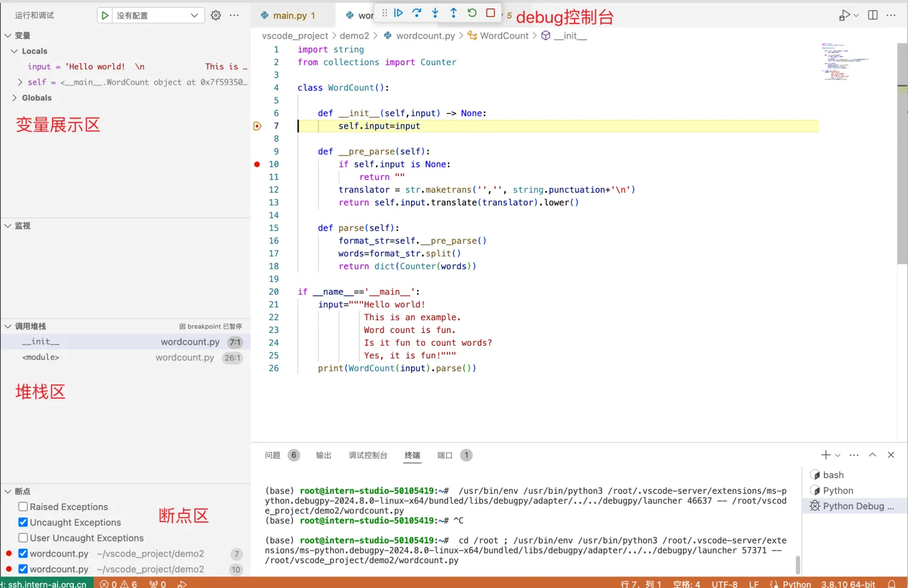
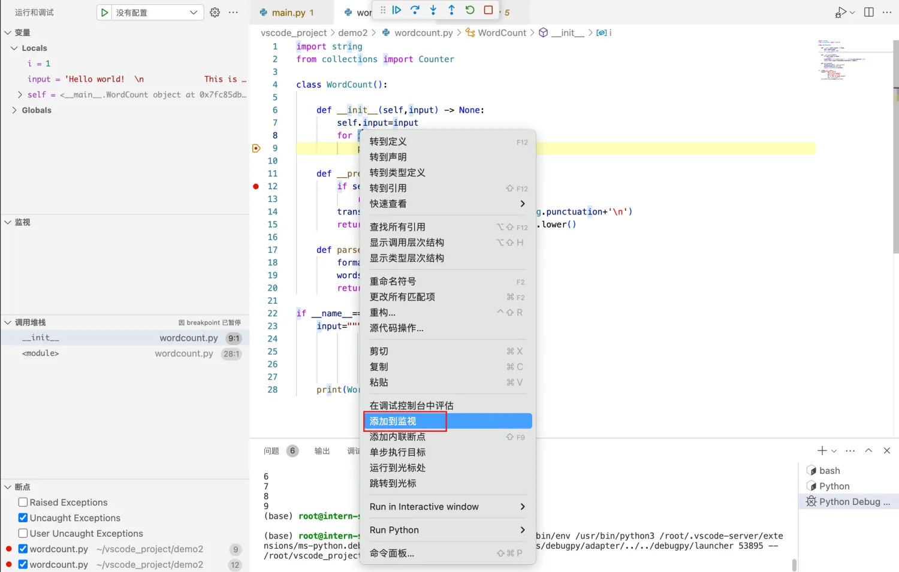
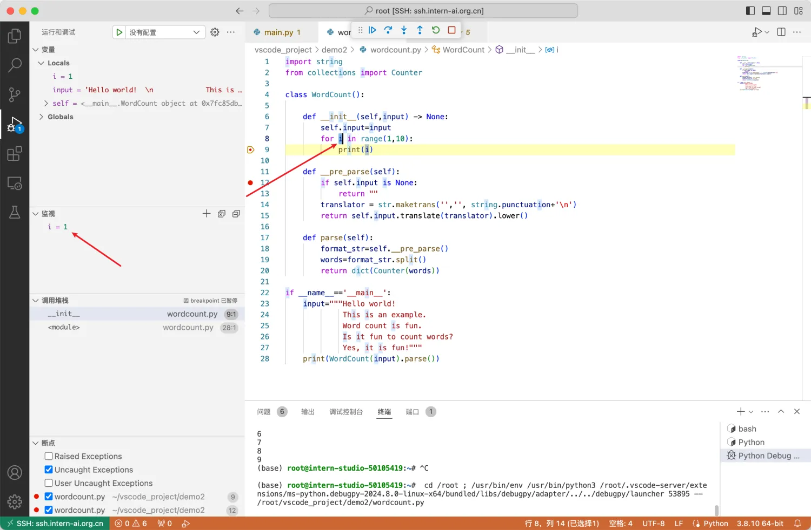
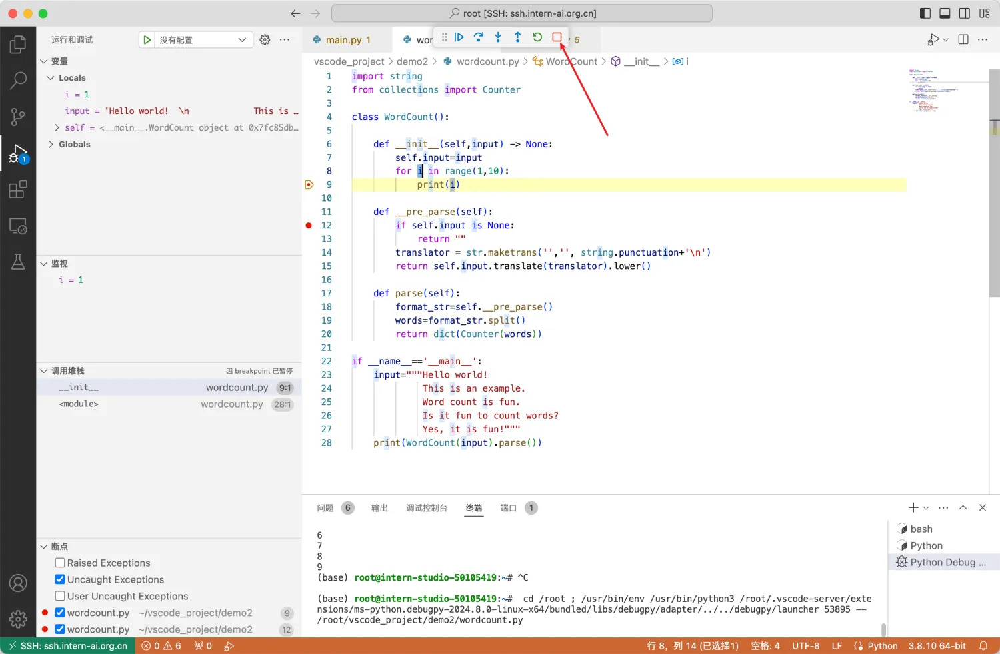

# Python基础知识
## 1、WordCount代码
```python
import string
from collections import Counter

class WordCount():

    def __init__(self,input) -> None:
        self.input=input

    def __pre_parse(self):
        if self.input is None:
            return ""
        translator = str.maketrans('','', string.punctuation+'\n')
        return self.input.translate(translator).lower()
    
    def parse(self):
        format_str=self.__pre_parse()
        words=format_str.split()
        return dict(Counter(words))

if __name__=='__main__':
    input="""Hello world!  
             This is an example.  
             Word count is fun.  
             Is it fun to count words?  
             Yes, it is fun!"""
    print(WordCount(input).parse())
```
## 2、远程断点调试
##### ① 首先在需要调试的代码上左键单击添加断点，显示红色标志添加成功


##### ② 运行debugger,开启调试




###### debug控制台
debug 控制台共有 6 个按钮，分别是：
● 跳到下个断点
● 步进（一行一行调试）
● 步入（进入函数内部调试）
● 单步跳出（跳转到调用当前函数的上一函数位置）
● 重启（重新开始 debug）
● 关闭调试
变量展示区
可以查看每个变量的对应的实例类型和值
堆栈区
可以看到函数调用链
断点区
可以方便的通过勾选☑️，来开启和关闭某一个断点
监视区
对想要重点查看的变量、可以通过右键->添加到监视来进行跟踪监控。如下图




##### ③ 关闭调试
